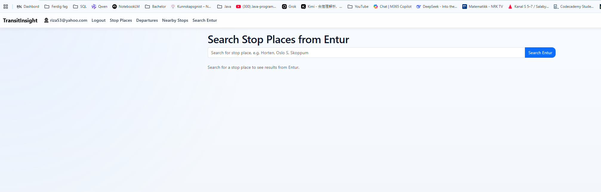
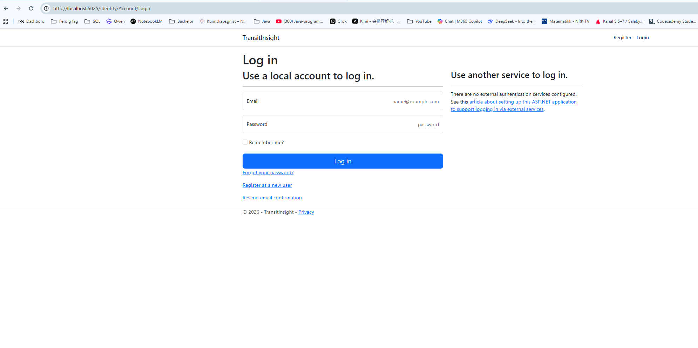

# TransitInsight

A modern ASP.NET Core MVC web application for monitoring public transport departures using the Entur API.

TransitInsight allows users to search for stop places, import live departures, monitor delays, and visualize transport data through an advanced real-time dashboard.

---

# Features

- ASP.NET Core MVC architecture
- Entity Framework Core with SQLite
- Entur API integration
- Live departure import
- Real-time dashboard refresh
- Transport statistics and charts
- Delay monitoring
- Nearby stops search
- Authentication system with ASP.NET Identity
- Responsive Bootstrap UI
- Chart.js data visualization
- Automatic live refresh system
- Git version control with branches
- xUnit automated testing

---

# Technologies Used

| Technology | Description |
|---|---|
| ASP.NET Core MVC | Web framework |
| Entity Framework Core | ORM / database |
| SQLite | Local database |
| ASP.NET Identity | Authentication |
| Bootstrap 5 | Responsive UI |
| Chart.js | Dashboard charts |
| Entur API | Public transport API |
| xUnit | Automated testing |
| Git & GitHub | Version control |

---

# System Architecture

The application follows the MVC architecture pattern:

- Models → database entities and view models
- Views → Razor UI pages
- Controllers → application logic
- Services → Entur API communication
- Data → Entity Framework database context

---

# Main Functionalities

## Dashboard

The dashboard displays:

- Total stop places
- Total departures
- Delay statistics
- Average delay time
- Latest live departures
- Transport mode charts
- Delay status chart
- Most active stop place
- Next upcoming departure

The dashboard automatically refreshes live data every 60 seconds.

---

## Stop Places

Users can:

- Create stop places manually
- Save stop places from Entur search
- Edit and delete stop places
- Import live departures

---

## Departures

The departures system supports:

- Real-time departures
- Delay calculation
- Destination overview
- Transport mode tracking
- Live updates from Entur API

---

## Nearby Stops

Users can:

- Search nearby stops using GPS
- Search by place name
- Display nearby stop locations
- View departures from nearby stops

---

## Authentication

The system includes:

- User registration
- User login
- Authorization protection
- ASP.NET Identity integration

---

# Automated Testing

The project includes xUnit automated tests.

Implemented tests include:

- StopPlace model tests
- Departure model tests
- Dashboard model tests

Example test areas:

- Name storage
- EnturId storage
- Delay calculations
- Dashboard statistics

All tests successfully passed.

---

# Screenshots

## Dashboard


## Departures


## Stop Places


## Search Entur



## Login System


---

# Installation

## Clone Repository

```bash
git clone https://github.com/YOUR-USERNAME/TransitInsight.git
```

---

## Open Project

Open:

```txt
TransitInsight.sln
```

in Visual Studio or VS Code.

---

## Run Database Migration

```bash
dotnet ef database update
```

---

## Run Application

```bash
dotnet run
```

Open browser:

```txt
http://localhost:5025
```

---

# Test Execution

Run automated tests:

```bash
dotnet test
```

---

# Project Structure

```txt
TransitInsight/
│
├── Controllers/
├── Models/
├── Views/
├── Services/
├── Data/
├── wwwroot/
├── screenshots/
├── TransitInsight.Tests/
└── README.md
```

---

# API Integration

The system uses the Entur public transport API for:

- Stop place search
- Live departures
- Transport information
- Delay monitoring

---

# Testing on Multiple Devices

The application was tested on:

- Desktop PC
- Laptop
- Multiple browsers

Results were consistent across devices.

---

# Known Warnings

Some NuGet packages may show low severity vulnerability warnings during build:

- NuGet.Protocol
- NuGet.Packaging

These warnings do not affect application functionality.

---

# Future Improvements

Possible future improvements include:

- SignalR real-time updates
- Interactive map integration
- Route planning
- Dark mode
- Admin roles
- Deployment to Azure
- Mobile responsive enhancements

---

# Author

Reza Gohari

---

# Course

TDS241 Fullstack / ASP.NET Core MVC Exam Project 2026

---

# License

This project was created for educational purposes.